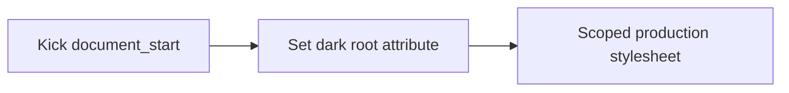

# Kick Night Mode Chrome Extension — Design

## Goal

Provide an always-on, privacy-preserving dark theme for the Kick accounting app
without changing Kick's layout, business behavior, or protected financial media.
The extension targets only `https://use.kick.co/*`. Disabling the extension in
Chrome is the escape hatch.

## Product principles

- **Private by construction:** no permissions, analytics, remote code, external
  requests, storage, or page-content inspection.
- **Dark before first paint:** a minimal `document_start` content script sets the
  dark root attribute synchronously and unconditionally.
- **Financial information stays legible:** receipts, uploaded documents, charts,
  avatars, logos, and printable financial media keep their normal rendering.
- **Calm hierarchy:** deep navy surfaces, neutral navigation, restrained
  dividers, and blue reserved for active states, focus, and content actions.
- **Evidence-backed resilience:** production selectors must match sanitized DOM
  captured from authenticated Kick routes.

## Visual system

| Token | Value | Use |
| --- | --- | --- |
| Page | `#0F1826` | Application background |
| Surface | `#1A2336` | Sidebar and primary panels |
| Raised | `#202B3D` | Cards, menus, dialogs, and headers |
| Hover | `#26344A` | Hovered, expanded, and selected states |
| Text | `#F4F7FB` | Primary text |
| Muted text | `#B7C0CE` | Secondary text and metadata |
| Subtle text | `#8F9CAF` | Placeholders and disabled content |
| Divider | `rgba(255, 255, 255, 0.10)` | Nonessential separation |
| Control border | `#718198` | Meaningful control boundaries |
| Accent | `#3793DA` | Focus, active states, and actions |
| Positive | `#53C28B` | Positive financial states |
| Warning | `#F2B84B` | Warnings |
| Negative | `#F2777A` | Errors and negative financial states |

## Architecture

The Manifest V3 package has no service worker, popup, action, or permissions.
Its only runtime code is `src/content.js`, declared for
`https://use.kick.co/*` at `document_start`. That script sets
`data-kick-night-mode="dark"` on the document root. The statically declared
stylesheet activates only beneath that root attribute.

The content script does not read the page, store a preference, register
listeners, or call Chrome runtime APIs.

## Styling strategy

Shared semantic elements establish the page, navigation, control, table, menu,
dialog, status, and focus foundations. Authenticated route captures then support
specific repairs for Clients, Accounts, Rules, Profit & Loss, Transactions,
Tasks, Invoicing, and Billing.

Every foreground override declares its intended background. Ordinary navigation
is neutral; blue is limited to current, focused, selected, or genuine action
states. Soft dividers separate structure while controls and focus rings retain
the stronger 3:1 boundary.

Media safety rules preserve images, video, canvas, SVG, receipts, attachments,
logos, avatars, embedded viewers, and third-party frames. Print media resets to
Kick's light financial presentation.

## Accessibility

- Normal text targets at least 4.5:1 contrast.
- Large text, controls, meaningful boundaries, and focus indicators target at
  least 3:1.
- Primary, secondary, placeholder, disabled, and total-row text remain visibly
  distinct.
- Hover, selected, expanded, disabled, and focus-visible states are tested.
- Status is never communicated by color alone.

## Security and privacy

- No Chrome permissions or broad host access.
- No remote scripts, fonts, images, styles, analytics, or network requests.
- No `eval`, dynamic code loading, DOM text reads, or page input listeners.
- Authenticated fixture capture sanitizes inside the page before serialization;
  only structure, allowlisted stable selectors, and synthetic text markers enter
  the repository.

## Testing

Automated checks cover unconditional activation, the absence of preference and
listener APIs, the simplified manifest, restricted Kick host access, selector
evidence, fixture privacy, computed contrast, interaction states, media safety,
print reset, desktop and compact snapshots, and packaged-extension validation.

Authenticated release QA reloads the unpacked extension before revisiting Tasks,
Transactions, Clients, Documents, Accounts, Rules, Profit & Loss, Invoicing, and
Billing. It exercises filters, menus, drawers, horizontal tables, empty states,
printing, and responsive widths, with zero non-exempt contrast failures or
console errors required.

## Acceptance criteria

- Dark mode applies synchronously on every matched Kick page.
- The manifest requests no permissions and matches only `use.kick.co`.
- Chrome extension controls provide the only enable/disable mechanism.
- No white glare bands, unreadable totals, low-contrast headings, or
  theme-caused clipping remain on audited routes.
- Protected financial media and print rendering are unchanged.
- No accounting data is read, stored, logged, or transmitted.
- Unit, visual, package-validation, and diff checks pass.
