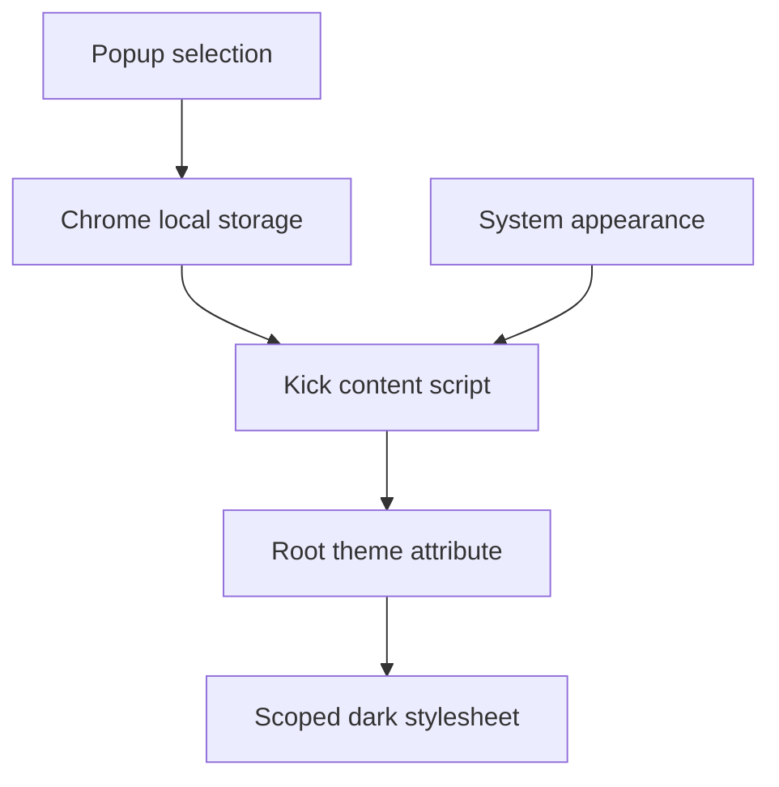

# Kick Night Mode Chrome Extension — Design

## Goal

Create a polished Chrome extension that makes Kick's web application comfortable to use at night without changing Kick's functionality or reading, transmitting, or storing accounting data.

The extension targets only `https://use.kick.co/*`. It provides Dark, Light, and System appearance modes, defaults to System, and remembers the user's choice locally.

## Product principles

- **Private by construction:** no analytics, remote code, external requests, or broad browsing permissions.
- **Financial information stays legible:** never invert receipts, uploaded documents, avatars, logos, or other media.
- **Calm visual hierarchy:** use charcoal and deep navy surfaces rather than pure black, with clear elevation and restrained contrast.
- **Reversible:** Light mode removes all extension styling immediately. Disabling or uninstalling the extension leaves Kick untouched.
- **Resilient:** selectors favor semantic elements and accessible attributes, with narrowly scoped fallbacks for current Kick UI patterns.

## User experience

The toolbar popup contains a Kick Night Mode identity, a three-option control for System, Light, and Dark, contextual status text, and a short privacy statement.

Choosing a mode updates every open Kick tab immediately through `chrome.storage` change notifications. System mode follows Chrome's `prefers-color-scheme` value and responds when it changes.

The extension does nothing on non-Kick pages. The preference can still be edited when the popup is opened elsewhere.

## Visual system

| Token | Value | Use |
| --- | --- | --- |
| Page | `#0F1826` | Application background |
| Surface | `#1A2336` | Sidebar and primary panels |
| Raised | `#202B3D` | Cards, menus, dialogs, table headers |
| Hover | `#26344A` | Interactive hover and selected rows |
| Text | `#F4F7FB` | Primary text |
| Muted text | `#B7C0CE` | Secondary text and metadata |
| Border | `rgba(255, 255, 255, 0.10)` | Dividers and controls |
| Accent | `#3793DA` | Focus, selection, and branded accents |
| Positive | `#53C28B` | Positive financial states |
| Warning | `#F2B84B` | Warnings |
| Negative | `#F2777A` | Errors and negative financial states |

The extension preserves existing semantic transaction colors. It restyles surrounding chart surfaces and labels but does not globally filter or recolor canvas, SVG, image, video, or embedded document content.

## Architecture

### Manifest

The Manifest V3 manifest declares only the `storage` permission, a content script limited to `https://use.kick.co/*`, locally packaged raster icons, and a popup action. It has no service worker.

### Theme core

A dependency-free shared module owns the valid modes (`system`, `light`, `dark`), preference validation, and System-mode resolution. It exposes a small API usable by both Chrome scripts and Node tests.

### Content script

The content script reads the preference, sets `data-kick-night-mode` on the root document, listens for storage changes, and watches `prefers-color-scheme` only while System is selected. The extension stylesheet is declared statically and activates only when the root attribute resolves to `dark`.

### Popup

The popup reads and validates the mode, renders an accessible radio group, saves changes to `chrome.storage.local`, and reports save failures without altering the selected mode. It does not inspect or message page content.

## Styling strategy

The CSS uses semantic page variables where possible, then covers major structural regions and common ARIA roles. Every rule is rooted under `html[data-kick-night-mode="dark"]`.

Media safety rules preserve normal rendering for images, video, canvas, SVG, receipt and attachment containers, logos, avatars, third-party iframes, and embedded document viewers. Print styles remove the extension theme.

## Data flow

Only the appearance string enters extension storage. No page content leaves the Kick tab or is copied into extension storage.

## Error handling

- Missing or malformed preference values fall back to System.
- A storage read failure falls back to System without blocking Kick.
- A storage write failure leaves the prior selection active and shows a concise popup error.
- If Chrome APIs are unavailable, the popup renders a non-destructive unavailable state.
- Kick DOM changes cannot break the underlying app; unmatched elements retain their original styling.

## Accessibility

- Popup controls use radio inputs grouped by a fieldset.
- Keyboard focus is visible and uses the Kick blue accent.
- Text and essential control boundaries target WCAG AA contrast.
- Reduced-motion preferences remove nonessential transitions.
- Status is never communicated by color alone.

## Security and privacy

- No `tabs`, `activeTab`, history, cookies, clipboard, scripting, or web-request permissions.
- No remote scripts, fonts, images, styles, analytics, or network requests.
- No `eval`, inline script execution, or dynamic code loading.
- Content scripts run in Chrome's isolated world.
- The content script reads no DOM text and registers no page input, click, or form listeners.

## Testing

Automated tests cover preference validation, System-mode resolution, root theme changes, storage and operating-system updates, popup persistence and failure handling, manifest restrictions, icon dimensions, CSS scoping, media protection, and print reset.

Manual Chrome verification covers unpacked loading, all three modes, reload persistence, multiple Kick tabs, non-Kick pages, keyboard navigation, and the principal accounting surfaces available without a production account.

## Acceptance criteria

- The extension loads in current desktop Chrome as Manifest V3.
- It requests only `storage` and access to `https://use.kick.co/*`.
- System is the default and follows the operating-system appearance.
- Mode changes apply without a page reload and persist.
- Receipts, documents, images, video, canvas, SVG, and third-party iframes are not globally inverted.
- Printing uses Kick's original light presentation.
- No accounting data is read, stored, logged, or transmitted.
- Automated checks pass.

