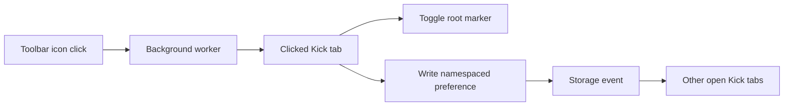

# Kick Night Mode Toolbar Toggle — Design

## Goal

Let the user switch Kick Night Mode between dark and Kick's original light
appearance by clicking the extension's Chrome toolbar icon.

The selected appearance is shared by every `use.kick.co` tab, applies to tabs
that are already open, survives page reloads and browser restarts, and becomes
the initial appearance of newly opened Kick tabs. Dark mode remains the default
until the user makes a choice.

## Interaction contract

- Clicking the extension icon on a Kick tab toggles between dark and light.
- A click updates every open Kick tab immediately.
- Reloading or navigating a Kick tab preserves the selected appearance.
- Newly opened Kick tabs inherit the selected appearance.
- Closing and reopening Chrome preserves the selected appearance.
- Clicking the extension icon on a non-Kick tab has no effect.
- The extension does not add a popup or settings screen.

## Architecture

The Manifest V3 package declares a toolbar `action` and a small background
service worker. The worker handles `chrome.action.onClicked` and attempts to
send a toggle message to the clicked tab. Only Kick tabs have the receiving
content script; a missing receiver on any other page is ignored. The worker
does not inspect the tab's URL or page content and does not store application
data.

The existing content script owns appearance state. It synchronously reads a
namespaced preference from `window.localStorage`, defaults to dark, and sets the
root `data-kick-night-mode` marker before the page paints. On a valid toggle
message, it switches the mode and writes the new preference.

Every Kick tab listens only for the browser's `storage` event for that exact
preference key. When one tab changes the preference, the remaining Kick tabs
apply the new mode immediately. The content script does not listen for page
clicks, typing, submissions, or navigation.

## State model

The preference key is extension-specific and stores only `dark` or `light`.
Missing, malformed, or inaccessible storage falls back to `dark`. Storage
failures do not prevent the page from loading or the current tab from toggling
for its active document.

The preference lives in the Kick origin's local storage so it can be read
synchronously at `document_start`. This avoids a light flash for dark users and
a dark flash for light users. Kick page code could technically observe or
change this non-sensitive appearance value; the content script therefore
validates every value before applying it.

## Styling

The existing stylesheet remains scoped to
`html[data-kick-night-mode="dark"]`. Light mode removes the dark marker rather
than attempting to restyle Kick. This restores Kick's own presentation and
keeps the dark-theme rules dormant.

## Privacy and permissions

- The manifest adds no Chrome permissions.
- The extension continues to run only on `https://use.kick.co/*`.
- The stored value is only an appearance string; no accounting content is read,
  stored, logged, or transmitted.
- The background worker handles only extension-toolbar clicks.
- The content script handles only extension messages and the namespaced storage
  event.
- No network requests, analytics, remote code, or dynamic code are introduced.

## Testing

Unit tests will prove:

- dark is the synchronous default when no preference exists;
- a stored light or dark preference is applied synchronously;
- a toolbar message toggles the clicked document and persists the result;
- storage events update other documents for the namespaced key only;
- malformed values and storage failures fall back safely;
- re-execution after a reload restores the stored selection;
- the background worker relays a click to its tab and safely ignores a missing
  content-script receiver;
- the manifest declares the action and worker without adding permissions; and
- packaged-extension validation includes the new local runtime file while
  preserving the privacy boundary.

The existing rendered dark-theme suite remains unchanged because the CSS
contract and dark root marker are unchanged.

## Acceptance criteria

- The toolbar icon is an actual light/dark toggle on Kick.
- All open Kick tabs converge on the selected appearance.
- Reloaded and newly opened Kick tabs use the selected appearance before paint.
- The choice survives browser restarts.
- Non-Kick pages are unaffected.
- No Chrome permission is added.
- All unit, visual, and package-validation checks pass.
